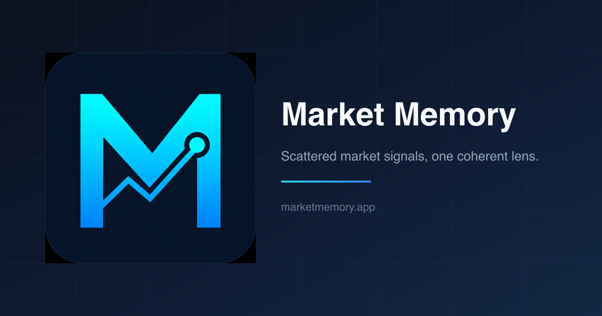

<p align="center">
  
</p>

<h1 align="center">Market Memory</h1>

<p align="center">
  <strong>Scattered market signals, one coherent lens.</strong>
</p>

<p align="center">
  An AI-assisted market intelligence platform that turns fragmented market information into structured, connected, and readable insight.
</p>

<p align="center">
  <a href="https://marketmemory.app"><strong>Visit Market Memory</strong></a>
  ·
  <a href="https://marketmemory.app/public-dashboard"><strong>View Public Dashboard</strong></a>
</p>

---

## About Market Memory

Financial markets generate an overwhelming amount of information every day.

News, earnings reports, economic indicators, price movements, policy decisions, and investor narratives often appear as isolated fragments. Understanding the market requires more than reading each piece individually. It requires connecting them over time.

**Market Memory organizes those scattered signals into a coherent reading experience.**

Instead of presenting another stream of headlines, it helps readers understand:

* what moved the market,
* which themes mattered,
* how individual events are connected,
* what has changed from previous periods,
* and what should be watched next.

Market Memory is built around one idea:

> Markets should not only be monitored.
> They should be remembered.

---

## What Market Memory Provides

### Daily Market Memory

A structured daily overview of the market, including:

* key market developments,
* major themes,
* changes in market sentiment,
* important data points,
* notable reports,
* and questions to monitor next.

### Market Snapshot

A compact view of the latest market environment, designed to provide context before reading detailed analysis.

### Structured Reports

Individual reports turn complex market events into readable analysis with:

* a clear headline,
* key takeaways,
* supporting data,
* interpretation,
* related themes,
* and forward-looking checkpoints.

### Report Archive

Past reports are stored as a growing market knowledge base rather than disappearing into a temporary news feed.

Readers can revisit previous analysis and follow how a narrative developed over time.

### Explore and Timeline Views

Reports can be explored through different reading surfaces:

* chronological timelines,
* topic-based exploration,
* report lists,
* and detailed report pages.

### Weekly Digests

Market Memory also provides dedicated weekly collections for:

* major global market issues,
* and important developments in AI and technology.

### Multilingual Reading

Market Memory is designed for readers across multiple regions.

Current supported languages:

* English
* 한국어
* 日本語

---

## Public Dashboard

The public dashboard provides a read-only preview of the Market Memory experience without requiring an account.

It includes:

* selected sample reports,
* the latest market edition,
* a market snapshot,
* Today’s Market Memory,
* recent published reports,
* and upcoming product directions.

Only finalized and preview-approved content is exposed through the public dashboard.

**Public preview:**
https://marketmemory.app/public-dashboard

---

## Product Philosophy

Most financial products focus on delivering more information.

Market Memory focuses on creating more context.

```text
News
  ↓
Events
  ↓
Themes
  ↓
Connections
  ↓
Market Memory
```

The goal is not to replace original reporting, professional research, or personal judgment.

The goal is to help readers see the relationship between events that would otherwise remain scattered across different sources and different moments in time.

---

## How It Works

```text
Market data and information
          ↓
Collection and normalization
          ↓
Multi-stage analysis pipeline
          ↓
Structured market reports
          ↓
Review and publication
          ↓
Dashboard, archive, and timeline
```

Market Memory uses AI-assisted workflows to organize information, identify relationships, generate structured analysis, and maintain consistency across multiple languages.

The product is designed as an evolving market knowledge system rather than a one-time content generator.

---

## Current Product Surfaces

```text
/
├── Landing page
├── Public dashboard
│   └── Public report previews
├── Authentication
├── Private dashboard
├── Report archive
│   ├── Report list
│   ├── Topic exploration
│   ├── Timeline
│   └── Report detail
├── Weekly AI Issue Digest
├── Weekly Market Issues
└── Administration
    ├── AI agents
    ├── Prompts
    ├── Pipelines
    ├── Localization
    └── Content management
```

---

## Technology Stack

| Area                 | Technology                                 |
| -------------------- | ------------------------------------------ |
| Application          | React 19, React Router 7, TypeScript       |
| UI                   | Tailwind CSS 4, Radix UI, Lucide, Recharts |
| Database             | PostgreSQL, Supabase                       |
| ORM                  | Drizzle ORM                                |
| Authentication       | Supabase SSR                               |
| Internationalization | i18next, react-i18next                     |
| Email                | Resend, React Email                        |
| Validation           | Zod                                        |
| Monitoring           | Sentry, Vercel Analytics                   |
| Testing              | Vitest, Playwright                         |
| Deployment           | Vercel                                     |

---

## Development Status

Market Memory is currently under active development and public beta testing.

The current focus is on:

* improving report quality and consistency,
* expanding the report archive,
* strengthening multilingual output,
* improving topic and timeline exploration,
* connecting current events with historical market context,
* and validating the product with real readers.

Some features and interfaces may change as the product evolves.

---

## Roadmap

Planned directions include:

* deeper historical market recall,
* improved archive navigation,
* stronger topic connections,
* personalized reading and bookmarks,
* market alerts,
* advanced search and filtering,
* additional weekly digests,
* and continuous multilingual quality improvements.

---

## License

Market Memory is **source-available, not open source**.

Selected portions of the source code are publicly visible for product
transparency, technical demonstration, and evaluation purposes.

Use, copying, modification, redistribution, deployment, and derivative works
require prior written approval. Commercial use is prohibited.

See [LICENSE.md](./LICENSE.md) for the full terms.

---

## Disclaimer

Market Memory provides information and analysis for educational and informational purposes only.

Nothing published through Market Memory should be considered:

* financial advice,
* investment advice,
* a recommendation to buy or sell an asset,
* or a substitute for independent professional judgment.

Market information may be incomplete, delayed, or inaccurate. Readers are responsible for their own investment decisions.

---

## Author

Created and maintained by [Jinu-hub](https://github.com/Jinu-hub).

---

<p align="center">
  <strong>Market Memory</strong><br />
  Scattered market signals, one coherent lens.
</p>
