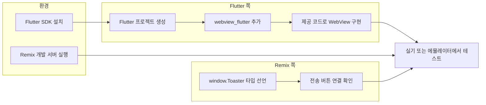

# Remix를 Flutter WebView로 감싸는 구현 계획

## 결론: Flutter 설치부터 시작하면 됨

Flutter 앱을 빌드·실행하려면 **Flutter SDK가 반드시 필요**합니다. Remix 쪽의 `sendMessageToApp`과 `window.Toaster` 호출은 이미 구현되어 있으므로, **Flutter 환경 구축 → Flutter 프로젝트 생성 → 동작 확인** 순서로 진행하면 됩니다.

---

## 전체 흐름(의존 관계)




- **Flutter 쪽**: 제공한 코드대로 채널명 `Toaster`와 Remix URL만 지정하면 됨.
- **Remix 쪽**: [app/features/home/screens/home.tsx](app/features/home/screens/home.tsx) 115~122행에서 이미 `window.Toaster.postMessage`를 호출 중. TypeScript에서 `window.Toaster` 타입 에러를 피하기 위한 선언과, 이 함수를 호출하는 UI(버튼) 유무 확인·정비가 필요함.

---

## 1. Flutter 환경 구축(여기서 시작)

- **macOS**: [공식 안내](https://docs.flutter.dev/get-started/install/macos)에 따라 Flutter SDK 설치 후 `flutter doctor`로 문제 없는지 확인.
- **Android 실기/에뮬레이터**: Android Studio에서 AVD 생성 또는 실기 USB 디버깅 활성화.
- **iOS 실기/시뮬레이터**(Mac 한정): Xcode 및 CocoaPods 설치 후 `flutter doctor`에서 iOS 도구 OK 확인.
- Android만 또는 iOS만 먼저 해도 됨.

---

## 2. Flutter 프로젝트 생성 및 구현

- 작업 폴더에서 `flutter create remix_webview_app` 등으로 새 프로젝트 생성.
- `pubspec.yaml`에 `webview_flutter` 추가 후 `flutter pub get`.
- 질문에 있던 `MyWebView`(채널 `Toaster` 등록 + `loadRequest`)를 해당 프로젝트의 메인 화면으로 넣기.
- **URL**: `loadRequest(Uri.parse('http://192.168.x.x:3000'));`의 `192.168.x.x`를 **Remix 개발 서버가 떠 있는 PC의 LAN IP**로 변경.
  - Android 에뮬레이터에서는 `10.0.2.2`로 호스트 PC의 localhost에 접근 가능하지만, 실기나 iOS는 반드시 PC IP(예: `192.168.1.10`)를 넣어야 함.
- **Android**: `android/app/src/main/AndroidManifest.xml`에 `android:usesCleartextTraffic="true"` 설정하여 HTTP 허용(개발용).
- **iOS**: `ios/Runner/Info.plist`에서 다음 둘 다 처리.
  - App Transport Security 예외 추가하여 해당 HTTP URL 접근 허용.
  - **로컬 네트워크 권한**: iOS 14 이후 동일 와이파이 내 PC 서버 접속 시 필요. `NSLocalNetworkUsageDescription` 키를 추가하고 설명 문구를 넣어야 실기에서 무한 로딩 없이 동작하며, 심사·테스트 시에도 안전함. 이 설정이 없으면 HTTP만 허용해도 실제 아이폰에서는 접속이 거부되거나 무한 로딩에 빠질 수 있음.
- **뒤로가기(Android)**: WebView만 쓰면 뒤로가기 시 앱이 바로 종료됨. `WebViewWidget`을 **PopScope**(Flutter 3.12+ 기준, 이전 버전은 `WillPopScope`)로 감싸서, 웹뷰 내부 히스토리가 있으면 `controller.goBack()`로 먼저 이전 페이지로 이동하고, 루트일 때만 앱 종료하도록 처리하는 것을 권장.
- **콘솔 로그 동기화**: 웹뷰 안의 `console.log`는 Flutter 터미널에 안 찍힘. `WebViewController` 설정에서 **onConsoleMessage**(또는 `webview_flutter` 해당 API)로 웹 콘솔 메시지를 Flutter 디버그 콘솔로 전달하면 디버깅 속도를 크게 높일 수 있음.

여기까지 하면 “Flutter 설치 → 프로젝트 생성 → 제공 코드 적용 → URL·권한·UX·디버깅”이 갖춰짐.

---

## 3. Remix 쪽 정비(Flutter와 병렬 또는 먼저 가능)

- **타입 선언**: `window.Toaster`는 DOM 기본 타입에 없으므로, 프로젝트 전역 타입 파일(예: `app/global.d.ts` 또는 `types/flutter-bridge.d.ts`)에 아래 추가 권장.

```ts
// Flutter WebView의 JavaScript 채널(Flutter 앱 안에서만 존재)
interface FlutterToasterChannel {
  postMessage(message: string): void;
}
declare global {
  interface Window {
    Toaster?: FlutterToasterChannel;
  }
}
```

- **UI**: `sendMessageToApp`이 아무 곳에서도 호출되지 않는 것 같으므로, 홈 화면 적당한 위치(예: Hero의 테스트용 버튼 또는 개발용 작은 링크)에 “앱으로 메시지 보내기” 같은 버튼을 추가하고 `onClick={sendMessageToApp}`로 연결.
  - 브라우저에서는 “지금은 웹 브라우저에서 보고 계시네요!”가, Flutter WebView에서는 SnackBar로 메시지가 뜨면 연동 완료.

---

## 4. 동작 확인 순서

1. **PC에서 Remix 실행 시 호스트 개방(가장 중요)**
  기본 설정은 `localhost:3000`만 리스닝해서, 같은 와이파이의 핸드폰이 PC IP(192.168.x.x)로 접속해도 거부됨.  
  - **해결**: 스크립트 수정 또는 실행 시 호스트 개방.  
  - **명령어 예**: `npx react-router dev --host`(이 프로젝트는 react-router 사용), 또는 Vite 기반이면 `npx vite --host` / `npx vite --host 0.0.0.0`.  
  - **권장**: `package.json`에 `"dev:mobile": "react-router dev --host"` 같은 스크립트를 추가해 두고, 실기/에뮬 테스트 시에는 `npm run dev:mobile`로 실행.
2. 같은 PC의 IP를 Flutter `loadRequest`에 넣고, Flutter 앱을 실기 또는 에뮬레이터에서 실행.
3. WebView에 Remix 홈이 뜨는지 확인.
4. “앱으로 메시지 보내기” 버튼을 누르면 Flutter 쪽에서 SnackBar에 “앱이 받은 메시지: 안녕 플러터! 나 리믹스야.”가 나오면 연동 완료.

---

## 5. 정리(무엇부터 할지)


| 순서  | 내용                                                                                                         |
| --- | ---------------------------------------------------------------------------------------------------------- |
| 1   | **Flutter SDK 설치** 및 `flutter doctor` 확인                                                                   |
| 2   | Flutter: 프로젝트 생성, `webview_flutter`·제공 코드 적용, URL·Android/iOS 권한, PopScope(뒤로가기), onConsoleMessage(로그 동기화) |
| 3   | Remix: `window.Toaster` 타입 선언 추가, `sendMessageToApp` 호출 버튼 추가                                              |
| 4   | Remix 서버 **호스트 개방**(`dev:mobile` 등)으로 실행 후 Flutter 앱에서 메시지 전송 E2E 확인                                       |


**“우선은 플러터 설치부터 시작 해야 하는건가?”**에 대한 답: **네. Flutter 설치부터 시작하시면 됩니다.** Remix 쪽은 이미 대부분 되어 있으므로, Flutter 환경이 갖춰지면 위 2번 프로젝트에서 WebView를 띄우고, 3번의 타입과 버튼으로 전송 테스트를 하면 됩니다.